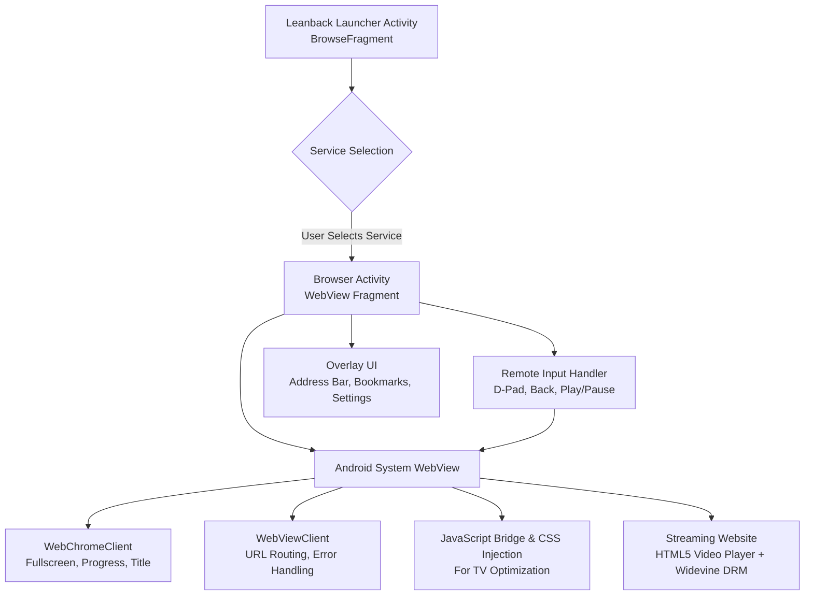

### Comprehensive Plan for an Android TV WebView Browser for Niche Streaming Services

This plan details the architecture, implementation, and optimization of a dedicated Android TV application that leverages `Android System WebView` to provide a lean-back browser experience. The goal is to bridge the gap for niche, independent, or regional streaming platforms that offer only a web-based player and lack a native Android TV application.

#### 1. Core Concept and Value Proposition

The application is not a general-purpose browser. It is a curated, TV-optimized web container designed to make desktop-oriented streaming websites usable with a standard Android TV remote (D-Pad). It solves the critical usability issues of browsing on a TV: lack of mouse/touch input, poor focus navigation, unreadable text, and non-functional fullscreen video. [Android Developers - Build TV Apps](https://developer.android.com/training/tv/start)

| Problem on Standard Web on TV | Solution in This App |
| :--- | :--- |
| Websites require mouse hover and precise clicks | Full D-Pad and spatial navigation support with visible focus highlight |
| Text and UI elements are too small for 10-foot viewing | Forced viewport scaling, CSS injection, and TV-safe default zoom |
| Video does not go fullscreen or controls are inaccessible | Custom `WebChromeClient` implementation for fullscreen `onShowCustomView` |
| Login sessions are lost after app restart | Persistent CookieManager and DOM Storage enabled |
| No native app launcher integration | Service-specific bookmarks with Leanback launcher tiles |

#### 2. High-Level System Architecture

The app follows a single-activity, multi-fragment architecture recommended for Android TV to ensure efficient navigation and lifecycle management. [Android Developers - WebView Overview](https://developer.android.com/develop/ui/views/layout/webapps/webview)



#### 3. Project Setup and Dependencies

**3.1. Development Environment Configuration**

1.  **Target SDK:** Target API Level 34+ (Android 14) to comply with Google Play requirements. Set `minSdkVersion` to 21 (Android 5.0) for maximum device coverage.
2.  **Manifest Declarations:** Declare the app as a TV app. This is required for visibility on the Play Store for TV devices.
    ```xml
    <uses-feature android:name="android.hardware.touchscreen" android:required="false" />
    <uses-feature android:name="android.software.leanback" android:required="true" />
    <uses-sdk android:minSdkVersion="21" />
    ```
    And add `android:usesCleartextTraffic` handling if any niche service does not use HTTPS. [Android Developers - Declare TV Support](https://developer.android.com/training/tv/start/hardware)

3.  **Dependencies:**
    *   `androidx.leanback:leanback` for TV UI components like `BrowseSupportFragment` and `DetailsSupportFragment`.
    *   `androidx.tvprovider` for optional channel recommendations on the TV home screen.
    *   `androidx.webkit:webkit` for modern WebView compatibility features via `AndroidX WebKit`.

**3.2. Android System WebView as a Dependency**

Android System WebView is a system component powered by Chromium that is updated independently through Google Play. Do not bundle a browser engine. Declare a dependency on an installed and updated WebView implementation to ensure security patches and codec support are current. [Google Play - Android System WebView](https://play.google.com/store/apps/details?id=com.google.android.webview)

#### 4. Core Implementation Plan

**4.1. WebView Configuration**

This is the most critical component. Incorrect configuration will break video playback, login, or navigation.

```kotlin
val webView: WebView = findViewById(R.id.webview)
val settings = webView.settings

settings.javaScriptEnabled = true // Required for all modern players
settings.domStorageEnabled = true // Required for login persistence and SPA frameworks
settings.mediaPlaybackRequiresUserGesture = false // Allow autoplay after user clicks play
settings.useWideViewPort = true
settings.loadWithOverviewMode = true
settings.allowFileAccess = false
settings.mixedContentMode = WebSettings.MIXED_CONTENT_COMPATIBILITY_MODE

CookieManager.getInstance().setAcceptCookie(true)
CookieManager.getInstance().setAcceptThirdPartyCookies(webView, true)
WebStorage.getInstance()

// Critical for TV performance
webView.isFocusable = true
webView.isFocusableInTouchMode = true
webView.setLayerType(View.LAYER_TYPE_HARDWARE, null)
```

Enable hardware acceleration at the application or activity level in `AndroidManifest.xml` (`android:hardwareAccelerated="true"`) for smooth video rendering. [Android Developers - WebSettings](https://developer.android.com/reference/android/webkit/WebSettings)

**4.2. User Agent Strategy**

Many niche streaming sites serve a mobile or blocked view to TV devices. Implement a switchable User-Agent.

| Mode | User Agent String | Use Case |
| :--- | :--- | :--- |
| **Desktop Mode (Default)** | Chrome on Windows 11: `Mozilla/5.0 (Windows NT 10.0; Win64; x64) AppleWebKit/537.36...` | Forces the full desktop player which is often more functional than the mobile site |
| **Mobile Mode** | Chrome on Android | Fallback if desktop site layout is completely unusable |
| **Native TV Mode** | Default WebView UA | For debugging only |

Allow the user to toggle this per-bookmark in Settings.

**4.3. Remote Control and D-Pad Navigation System**

Android TV interaction is based on D-Pad directional keys and focus. Web content is not designed for this by default.

1.  **Native Focus Handling:** WebView has built-in spatial navigation. Ensure the WebView itself can receive focus and that you do not intercept `KEYCODE_DPAD_*` events unnecessarily. The WebView will handle focus movement between HTML elements internally.
2.  **Focus Visibility Enhancement:** Inject CSS via `evaluateJavascript` after page load to make the focused element highly visible on a TV screen, as default browser outlines are often invisible from a distance.
    ```javascript
    // Injected CSS
    *:focus { outline: 3px solid #00BFFF !important; outline-offset: 2px !important; box-shadow: 0 0 12px #00BFFF !important; }
    ```
3.  **Key Event Mapping:** Override `onKeyDown` in the Activity to handle special remote keys.

    | Remote Key | KeyCode | Action |
    | :--- | :--- | :--- |
    | Back | `KEYCODE_BACK` | If `webView.canGoBack()`, call `webView.goBack()`, else close overlay or exit |
    | D-Pad Center / Enter | `KEYCODE_DPAD_CENTER` | Pass to WebView for click |
    | Play/Pause | `KEYCODE_MEDIA_PLAY_PAUSE` | Inject JS media key event: `document.querySelector('video')?.paused ? .play() : .pause()` |
    | Fast Forward / Rewind | `KEYCODE_MEDIA_FAST_FORWARD` | Seek video forward 10 seconds via JS |
    | Menu / Info | `KEYCODE_MENU` | Toggle the browser overlay UI |

[Android Developers - Handle TV Navigation](https://developer.android.com/training/tv/start/navigation)

**4.4. Video Playback and Fullscreen Handling**

This is mandatory for any streaming app. Without it, video will play in a small embedded rectangle.

Implement a custom `WebChromeClient`:
*   `onShowCustomView(view: View, callback: CustomViewCallback)`: Hide the main WebView and display the `view` (which contains the fullscreen video) in a `FrameLayout` container. Hide system UI for immersive mode.
*   `onHideCustomView()`: Restore the normal WebView layout and show system UI.
*   `onProgressChanged` and `onReceivedTitle`: To update a loading progress bar.

Widevine DRM: Most niche streaming services use Widevine for DRM. WebView supports Widevine L3 via Encrypted Media Extensions (EME). However, it does not support L1 hardware DRM. This must be tested per service, as some services requiring L1 will fail to play in 1080p or at all inside WebView. Document this limitation. [Android Developers - WebChromeClient](https://developer.android.com/reference/android/webkit/WebChromeClient)

#### 5. UI / UX Design for TV (10-Foot UI)

Do not show a desktop-like address bar permanently. Use a Leanback-inspired overlay.

1.  **Home Screen (`BrowseSupportFragment`):** Display a grid of pre-configured or user-added streaming services with large banner icons (e.g., 300x170dp). Each tile launches the Browser Activity with a preset URL. This allows quick access without typing.
2.  **Browser Overlay:** An overlay that appears when the user presses Up or Menu. It should contain: Back, Forward, Refresh, Home, Address Bar (editable via `Leanback Keyboard`), Bookmark, and Settings. It should auto-hide after 3 seconds of inactivity during video playback.
3.  **Text Input:** Never use a standard `EditText` for URL entry. Launch the Leanback `GuidedStepSupportFragment` or use the `androidx.leanback.widget.SearchBar` which invokes the native TV keyboard with voice input support.
4.  **Zoom and Text Scaling:** Provide user-accessible controls for `webView.settings.textZoom` (e.g., 100%, 125%, 150%) to fix sites with tiny fonts.

#### 6. Session, Data, and Error Management

*   **Persistence:** Use `CookieManager.getInstance().flush()` in `onPause()` to ensure login cookies, watch history, and preferences are saved. WebView shares cookies with the app's lifecycle, so a user should only need to log in once per service.
*   **Error Handling:** Implement `WebViewClient.onReceivedError` and `onReceivedHttpError` to show a TV-friendly error card (e.g., "Video unavailable. This service may block TV browsers. Try switching User Agent in Settings") instead of a blank page. [Android Developers - WebViewClient](https://developer.android.com/reference/android/webkit/WebViewClient)
*   **Ad-Blocking / Cleanup:** Offer an optional, lightweight content blocker that injects JavaScript to hide common overlay pop-ups that are impossible to close with a remote. This must be optional and transparent to the user.

