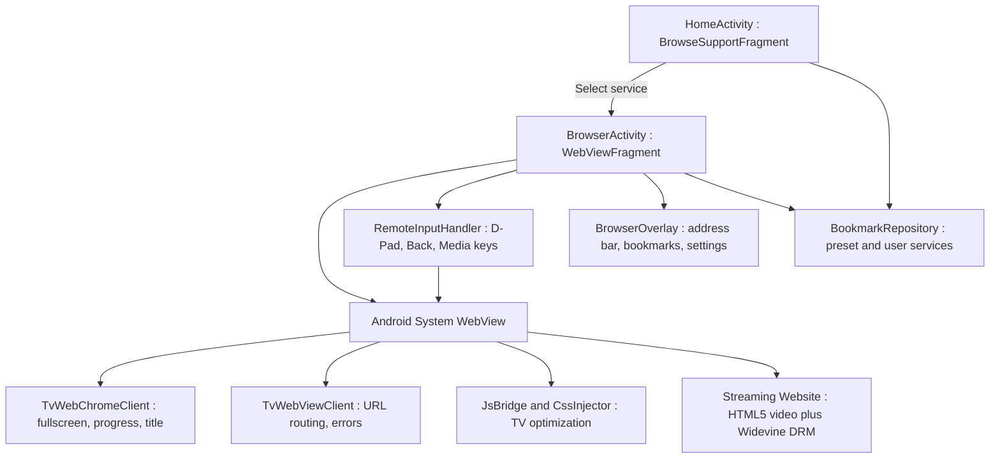
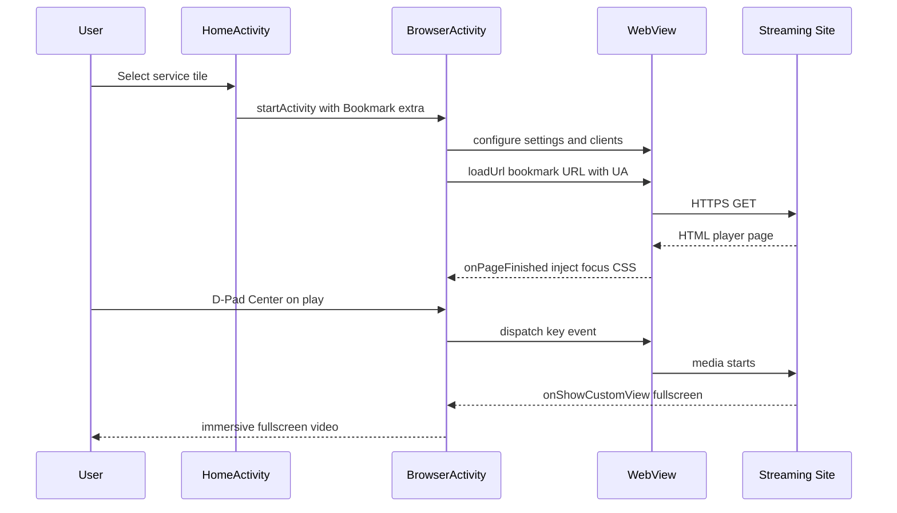

# Architecture Overview

## 1. Purpose

Defines the structural decomposition of the application: activities, fragments,
WebView client components, input handling, and overlay UI, together with their
runtime interactions. All sibling specifications refine components introduced
here. See [00-spec-index.md](./00-spec-index.md) for governance.

## 2. System Context

The application bridges niche streaming services that expose only a desktop web
player to Android TV. It is **not** a general-purpose browser.

| Problem on Standard Web on TV | Solution in This App | Refined In |
|-------------------------------|----------------------|------------|
| Sites require mouse hover and precise clicks | Full D-Pad spatial navigation with visible focus highlight | [05](./05-input-and-dpad-navigation.md) |
| Text/UI too small for 10-foot viewing | Forced viewport scaling, CSS injection, TV-safe zoom | [03](./03-webview-configuration.md), [07](./07-ui-ux-leanback-design.md) |
| Video does not go fullscreen | Custom `WebChromeClient` with `onShowCustomView` | [06](./06-video-playback-and-fullscreen.md) |
| Login sessions lost on restart | Persistent `CookieManager` + DOM storage | [08](./08-session-and-data-persistence.md) |
| No launcher integration | Service bookmarks as Leanback tiles | [07](./07-ui-ux-leanback-design.md) |

## 3. Architecture Decision AD-1: Two Activities, Not One

`PLAN.md` §2 prose states "single-activity, multi-fragment," while its own
diagram depicts a Launcher Activity and a Browser Activity. **Decision: two
activities.** Rationale:

1. `BrowseSupportFragment` is conventionally hosted in a dedicated home activity
   with the Leanback theme; mixing it with an immersive fullscreen video host
   complicates theme and window-flag management.
2. Fullscreen video requires activity-level control of system UI visibility and
   `FLAG_KEEP_SCREEN_ON`; isolating this in `BrowserActivity` limits blast radius.
3. Process-recovery semantics are simpler: the home activity has no WebView
   state to restore.

The intent of the source plan (efficient navigation, disciplined lifecycle) is
preserved; only the activity count changes.

## 4. Component Diagram

## 5. Module Responsibilities

| Component | Responsibility | Detailed Spec |
|-----------|----------------|---------------|
| `HomeActivity` | Hosts `BrowseSupportFragment`; renders service grid; launches `BrowserActivity` with a `Bookmark` parcel | [07](./07-ui-ux-leanback-design.md) |
| `BrowserActivity` | Hosts `WebViewFragment`; owns key dispatch, overlay, fullscreen container, immersive mode | [05](./05-input-and-dpad-navigation.md), [06](./06-video-playback-and-fullscreen.md), [07](./07-ui-ux-leanback-design.md) |
| `WebViewFragment` | Owns the `WebView` instance; applies settings; installs clients; lifecycle binding | [03](./03-webview-configuration.md) |
| `TvWebViewClient` | URL allow/routing policy, error interception, HTTP error surfacing | [09](./09-error-handling-and-recovery.md) |
| `TvWebChromeClient` | Fullscreen custom view, progress, title, JS dialogs | [06](./06-video-playback-and-fullscreen.md) |
| `JsBridge` / `CssInjector` | Injects focus-highlight CSS and media-control JS after navigation commits | [05](./05-input-and-dpad-navigation.md), [10](./10-content-filtering-and-cleanup.md) |
| `RemoteInputHandler` | Maps remote keycodes to WebView or overlay actions | [05](./05-input-and-dpad-navigation.md) |
| `BrowserOverlay` | Auto-hiding transport bar: back, forward, refresh, home, address, bookmark, settings | [07](./07-ui-ux-leanback-design.md) |
| `BookmarkRepository` | CRUD for service bookmarks incl. per-bookmark UA mode and zoom | [08](./08-session-and-data-persistence.md) |
| `UserAgentProvider` | Resolves effective UA string per bookmark and global default | [04](./04-user-agent-strategy.md) |

## 6. Primary Navigation Flow

## 7. Process and Threading Model

- **Single process** (`android:process` unset). WebView renders in the app
  process on API 21–27; from API 28+ WebView may use an isolated renderer
  process — renderer death MUST be handled via
  `WebViewClient.onRenderProcessGone` (see
  [09-error-handling-and-recovery.md](./09-error-handling-and-recovery.md) §5).
- **Main thread**: all `WebView`, `WebSettings`, `CookieManager`, and key
  dispatch calls. No WebView API MAY be called off the UI thread.
- **Disk I/O** (bookmark persistence, UA overrides) MUST run on
  `Dispatchers.IO` via coroutines; results posted to main.

## 8. Lifecycle Contract

| Lifecycle Event | Mandatory Action |
|-----------------|------------------|
| `BrowserActivity.onPause` | `webView.onPause()`, `CookieManager.flush()` (see [08](./08-session-and-data-persistence.md) §4) |
| `BrowserActivity.onResume` | `webView.onResume()` |
| `BrowserActivity.onDestroy` | Exit fullscreen if active, remove WebView from parent, `webView.destroy()` |
| `onTrimMemory(LEVEL_UI_HIDDEN)` | No-op for WebView (destroying it loses playback); release overlay bitmap caches only |
| Configuration change | Locked to `landscape` + `screenSize|screenLayout|keyboardHidden` handled in manifest to avoid WebView recreation mid-playback |

## 9. External Dependencies

| Dependency | Nature | Failure Mode |
|------------|--------|--------------|
| Android System WebView (system component, Play-updated) | Required runtime | Missing/disabled/outdated → gate screen, see [02](./02-project-setup-and-dependencies.md) §7 |
| Google Play (WebView update channel) | Soft | Stale WebView → warn, continue |
| Streaming service sites | Remote, uncontrolled | Markup drift breaks injected JS; mitigations in [10](./10-content-filtering-and-cleanup.md) §6 |

## 10. Non-Goals

- Tabbed browsing, history UI beyond session back-stack, downloads.
- Bundling GeckoView/Chromium fork (forbidden by plan §3.2).
- Circumventing DRM or paywalls (see [11-security-privacy-and-drm.md](./11-security-privacy-and-drm.md)).
- Touch-first phone UX; phone form factor is explicitly unsupported.

## 11. Quality Attributes and Top Risks

| Attribute | Target | Mechanism |
|-----------|--------|-----------|
| Video start latency | ≤ 5 s on cached session | Hardware layers, no proxying |
| Input latency | D-Pad focus move ≤ 100 ms | Native WebView spatial nav, no JS shim on hot path |
| Session durability | Login survives process death | Cookie flush + DOM storage, [08](./08-session-and-data-persistence.md) |
| Risk: Widevine L1-required services | Known limitation | Documented, per-service matrix in [12](./12-testing-and-validation-matrix.md) |
| Risk: site markup drift | High probability | All injected selectors centralized and versioned, [10](./10-content-filtering-and-cleanup.md) |

## 12. Cross-References

- Build/manifest: [02-project-setup-and-dependencies.md](./02-project-setup-and-dependencies.md)
- WebView core: [03-webview-configuration.md](./03-webview-configuration.md)
- Input: [05-input-and-dpad-navigation.md](./05-input-and-dpad-navigation.md)
- Media: [06-video-playback-and-fullscreen.md](./06-video-playback-and-fullscreen.md)
