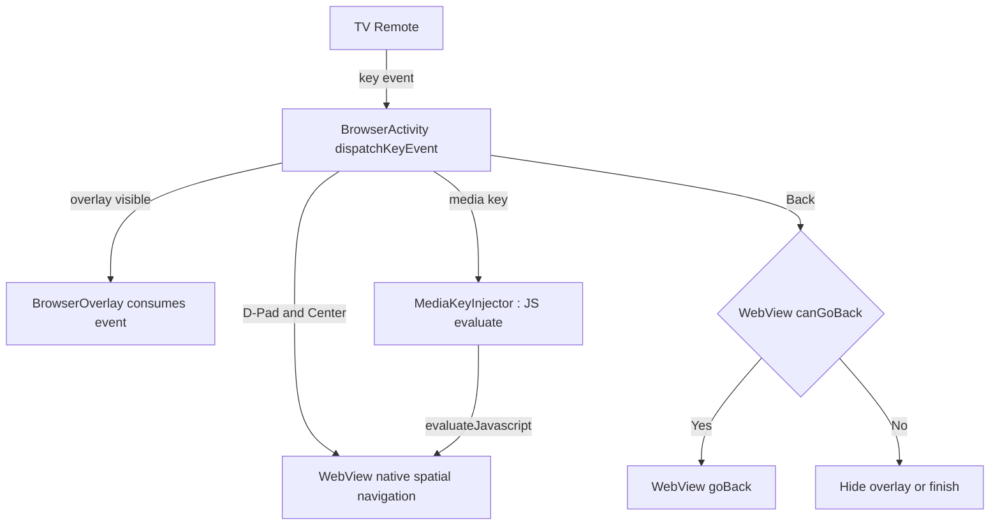

# Remote Input and D-Pad Navigation

## 1. Purpose

Defines how Android TV remote events flow into WebView content: native spatial
navigation, focus-visibility CSS injection, and special-key mapping (plan §4.3).
Operates on the configured WebView from
[03-webview-configuration.md](./03-webview-configuration.md).

## 2. Input Architecture



## 3. Key Event Mapping (Normative)

| Remote Key | KeyCode | Action |
|------------|---------|--------|
| Back | `KEYCODE_BACK` | If overlay visible → hide overlay; else if `webView.canGoBack()` → `goBack()`; else `finish()` |
| D-Pad directions | `KEYCODE_DPAD_UP/DOWN/LEFT/RIGHT` | Pass through to WebView; do NOT intercept |
| D-Pad Center / Enter | `KEYCODE_DPAD_CENTER`, `KEYCODE_ENTER` | Pass through to WebView for click |
| Play/Pause | `KEYCODE_MEDIA_PLAY_PAUSE` | Inject JS toggle (§6) |
| Fast Forward | `KEYCODE_MEDIA_FAST_FORWARD` | Seek +10 s via JS (§6) |
| Rewind | `KEYCODE_MEDIA_REWIND` | Seek −10 s via JS (§6) |
| Menu / Info | `KEYCODE_MENU` | Toggle browser overlay (see [07](./07-ui-ux-leanback-design.md) §4) |
| D-Pad Up (when overlay hidden and page focused) | `KEYCODE_DPAD_UP` | If first focus move reaches page top, show overlay — implemented as overlay peek trigger |

## 4. Dispatch Implementation

```kotlin
class RemoteInputHandler(
    private val webView: WebView,
    private val overlay: BrowserOverlayController,
    private val mediaKeys: MediaKeyInjector,
    private val onExit: () -> Unit
) {
    fun onKeyDown(keyCode: Int, event: KeyEvent): Boolean = when (keyCode) {
        KeyEvent.KEYCODE_BACK -> {
            when {
                overlay.isVisible -> { overlay.hide(); true }
                webView.canGoBack() -> { webView.goBack(); true }
                else -> { onExit(); true }
            }
        }
        KeyEvent.KEYCODE_MEDIA_PLAY_PAUSE -> { mediaKeys.togglePlayPause(); true }
        KeyEvent.KEYCODE_MEDIA_FAST_FORWARD -> { mediaKeys.seekBy(+10_000); true }
        KeyEvent.KEYCODE_MEDIA_REWIND -> { mediaKeys.seekBy(-10_000); true }
        KeyEvent.KEYCODE_MENU -> { overlay.toggle(); true }
        else -> false // D-Pad and Center fall through to WebView
    }
}
```

`BrowserActivity.onKeyDown` delegates to this handler first; unhandled events
MUST call `super.onKeyDown` so WebView's native spatial navigation receives
D-Pad events. Intercepting `KEYCODE_DPAD_*` for custom JS navigation is
FORBIDDEN on the hot path — native spatial navigation is faster and more
reliable than any JS shim.

## 5. Focus Visibility Enhancement

Default browser focus outlines are invisible from 10 feet. Inject CSS after
every committed navigation. Asset `app/src/main/assets/tv_focus.css`:

```css
*:focus {
    outline: 3px solid #00BFFF !important;
    outline-offset: 2px !important;
    box-shadow: 0 0 12px #00BFFF !important;
}
```

Injector:

```kotlin
class CssInjector(private val assetLoader: (String) -> String) {
    fun injectFocusHighlight(webView: WebView) {
        val css = assetLoader("tv_focus.css")
            .replace("\\", "\\\\").replace("\"", "\\\"")
            .replace("\n", " ")
        webView.evaluateJavascript(
            """(function(){
                 var id='tv-focus-style';
                 if(!document.getElementById(id)){
                   var s=document.createElement('style');
                   s.id=id; s.textContent="$css";
                   document.head.appendChild(s);
                 }
               })();""", null
        )
    }
}
```

Injection timing rules:

1. Inject in `WebViewClient.onPageFinished`.
2. SPAs that swap content via `history.pushState` do not fire `onPageFinished`;
   therefore `TvWebViewClient.doUpdateVisitedHistory` MUST also trigger
   injection (idempotent — the `tv-focus-style` guard prevents duplicates).
3. Injection MUST be wrapped so a page with a restrictive CSP that blocks
   inline styles fails silently (navigation still works; focus visibility
   degrades gracefully).

## 6. Media Key Bridge

```kotlin
class MediaKeyInjector(private val webView: WebView) {

    fun togglePlayPause() = eval(
        """(function(){var v=document.querySelector('video');if(!v)return;
             v.paused?v.play():v.pause();})();"""
    )

    fun seekBy(deltaMs: Long) = eval(
        """(function(){var v=document.querySelector('video');if(!v)return;
             v.currentTime=Math.max(0,Math.min(v.duration||1e9,
               v.currentTime+($deltaMs/1000)));})();"""
    )

    private fun eval(js: String) = webView.evaluateJavascript(js, null)
}
```

Note: when multiple `<video>` elements exist (ad + content), `querySelector`
returns the first. If field reports show ad-seeking instead of content-seeking,
upgrade the selector to choose the largest visible video; that heuristic and
its selector list live in
[10-content-filtering-and-cleanup.md](./10-content-filtering-and-cleanup.md) §5.

## 7. Native Focus Handling Rules

1. The WebView MUST be focusable (`isFocusable`, `isFocusableInTouchMode` —
   set in [03](./03-webview-configuration.md) §3).
2. When the overlay opens, focus MUST move to the overlay's first button; when
   it closes, focus MUST return to the WebView via `webView.requestFocus()`.
3. Never wrap the WebView in a `ScrollView` or `NestedScrollView`; WebView
   scrolls internally.

## 8. Error Handling and Edge Cases

| Failure | Symptom | Handling |
|---------|---------|----------|
| Page calls `preventDefault` on D-Pad keys | Focus frozen | Site-specific JS patch list in [10](./10-content-filtering-and-cleanup.md) §5; never global key capture |
| Focus trapped inside cross-origin iframe | D-Pad cycles inside iframe | Documented limitation; user workaround is Back then re-enter. No programmatic fix available pre-API 33 `WebView` focus APIs |
| `evaluateJavascript` on destroyed WebView | Silent no-op / `IllegalStateException` | All injectors check `webView.isAttachedToWindow` before eval |
| IME steals `KEYCODE_DPAD_CENTER` during URL entry | Overlay address field consumes key | Expected; overlay owns focus while open ([07](./07-ui-ux-leanback-design.md) §5) |
| Long-press D-Pad Center repeats clicks | Double play/pause toggles | Handler ignores `event.repeatCount > 0` for media keys |
| Remotes without media keys (minimal remotes) | No play/pause control | Overlay transport buttons provide the same JS calls |

## 9. Cross-References

- Overlay focus contract: [07-ui-ux-leanback-design.md](./07-ui-ux-leanback-design.md)
- Fullscreen key behavior (Back exits fullscreen first):
  [06-video-playback-and-fullscreen.md](./06-video-playback-and-fullscreen.md) §6
- Site-specific patches: [10-content-filtering-and-cleanup.md](./10-content-filtering-and-cleanup.md)
