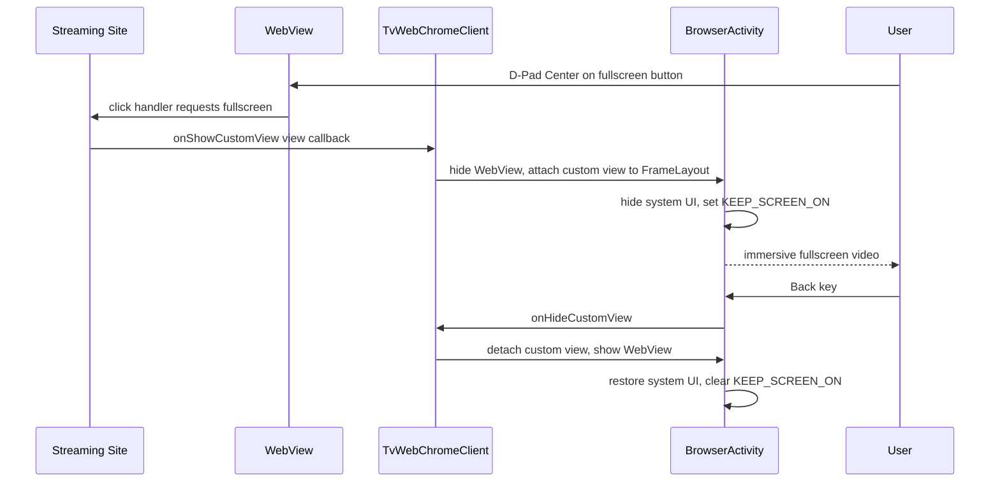

# Video Playback and Fullscreen Handling

## 1. Purpose

Mandatory for any streaming app: without a custom `WebChromeClient`, HTML5
video plays in a small embedded rectangle (plan §4.4). This spec defines the
fullscreen container protocol, progress/title plumbing, and DRM constraints.
Built on the WebView instance from
[03-webview-configuration.md](./03-webview-configuration.md) and the key
handling from [05-input-and-dpad-navigation.md](./05-input-and-dpad-navigation.md).

## 2. Fullscreen Sequence



## 3. Reference Implementation

```kotlin
class TvWebChromeClient(
    private val activity: Activity,
    private val fullscreenContainer: FrameLayout,
    private val webView: WebView,
    private val progressBar: ProgressBar,
    private val titleCallback: (String) -> Unit
) : WebChromeClient() {

    private var customView: View? = null
    private var customViewCallback: CustomViewCallback? = null

    override fun onShowCustomView(view: View, callback: CustomViewCallback) {
        if (customView != null) { callback.onCustomViewHidden(); return }
        customView = view
        customViewCallback = callback

        webView.visibility = View.GONE
        fullscreenContainer.addView(
            view,
            FrameLayout.LayoutParams(MATCH_PARENT, MATCH_PARENT)
        )
        fullscreenContainer.visibility = View.VISIBLE

        activity.window.apply {
            addFlags(WindowManager.LayoutParams.FLAG_KEEP_SCREEN_ON)
            decorView.systemUiVisibility =
                View.SYSTEM_UI_FLAG_IMMERSIVE_STICKY or
                View.SYSTEM_UI_FLAG_FULLSCREEN or
                View.SYSTEM_UI_FLAG_HIDE_NAVIGATION or
                View.SYSTEM_UI_FLAG_LAYOUT_STABLE or
                View.SYSTEM_UI_FLAG_LAYOUT_FULLSCREEN or
                View.SYSTEM_UI_FLAG_LAYOUT_HIDE_NAVIGATION
        }
    }

    override fun onHideCustomView() {
        val view = customView ?: return
        fullscreenContainer.removeView(view)
        fullscreenContainer.visibility = View.GONE
        customView = null
        customViewCallback?.onCustomViewHidden()
        customViewCallback = null

        webView.visibility = View.VISIBLE
        activity.window.apply {
            clearFlags(WindowManager.LayoutParams.FLAG_KEEP_SCREEN_ON)
            decorView.systemUiVisibility = View.SYSTEM_UI_FLAG_VISIBLE
        }
    }

    fun isInFullscreen(): Boolean = customView != null

    fun exitFullscreen() {
        if (isInFullscreen()) customViewCallback?.onCustomViewHidden()
    }

    override fun onProgressChanged(view: WebView, newProgress: Int) {
        progressBar.isVisible = newProgress < 100
        progressBar.progress = newProgress
    }

    override fun onReceivedTitle(view: WebView, title: String) {
        titleCallback(title)
    }
}
```

## 4. Behavioral Rules

1. **Back-key precedence** (amends [05](./05-input-and-dpad-navigation.md) §3):
   if `isInFullscreen()`, Back MUST call `exitFullscreen()` and be consumed —
   before overlay handling, before `goBack()`.
2. **Double-enter guard**: a second `onShowCustomView` while one is active MUST
   immediately call the new callback's `onCustomViewHidden()` (implemented
   above). Nesting custom views leaks surfaces.
3. **Callback leak**: `customViewCallback` MUST be nulled exactly once per
   hide; calling it twice throws on some WebView versions.
4. **Progress bar**: hidden when `newProgress == 100`; MUST NOT render during
   fullscreen (it lives in the hidden WebView layer).
5. **Orientation**: locked landscape by manifest
   ([02](./02-project-setup-and-dependencies.md) §4); fullscreen MUST NOT
   request sensor orientation — TV form factor.

## 5. DRM: Widevine Constraints

| Aspect | Status |
|--------|--------|
| Widevine L3 (software, via EME) | Supported in WebView; most niche services play |
| Widevine L1 (hardware-backed) | NOT supported in WebView |
| Consequence | Services requiring L1 fail entirely or refuse >540p/720p |
| Action | Per-service compatibility MUST be recorded in [12-testing-and-validation-matrix.md](./12-testing-and-validation-matrix.md) §4; the error card copy ([09](./09-error-handling-and-recovery.md) §4) MUST mention possible DRM limitation when EME errors surface |

EME failure detection: listen for `DOMException` on
`navigator.requestMediaKeySystemAccess` via an injected error hook; surface a
distinct "DRM not supported by this service on TV browsers" card rather than a
generic network error. On WebView builds where the EME API is absent
entirely (some AOSP/system WebView providers), the hook installs a rejecting
`requestMediaKeySystemAccess` stub that both throws the standard
`NotSupportedError` to the site and reports the DRM category, so DRM-dependent
services surface the same card; non-DRM sites never call the API and are
unaffected.

## 6. Error Handling and Edge Cases

| Failure | Symptom | Handling |
|---------|---------|----------|
| Site uses the Fullscreen API on a wrapper `div`, not the video | "Fullscreen" shows a letterboxed div | Acceptable; do not attempt DOM surgery. Log domain for [10](./10-content-filtering-and-cleanup.md) patching |
| Process death during fullscreen | On relaunch, WebView restored but custom view gone | `onCreate` MUST call `exitFullscreen()` defensively and reload last URL from saved state |
| `onHideCustomView` never delivered (site bug, e.g., navigation while fullscreen) | Stuck black container | `TvWebViewClient.onPageStarted` MUST force `exitFullscreen()` |
| HDMI hotplug / CEC standby | Activity paused mid-playback | `onPause` calls `webView.onPause()` (see [01](./01-architecture-overview.md) §8); playback resumes on `onResume` |
| Codec unsupported by WebView build (e.g., HEVC on old provider) | `MEDIA_ERR_SRC_NOT_SUPPORTED` | Provider version warning from [02](./02-project-setup-and-dependencies.md) §7; document per-service |
| Audio focus loss (notification, voice search, second app) | Video keeps playing over other audio | Register `AudioManager.OnAudioFocusChangeListener`; on `AUDIOFOCUS_LOSS` pause playback (only if playing); on `AUDIOFOCUS_LOSS_TRANSIENT` pause; on `AUDIOFOCUS_GAIN` do NOT auto-resume (user presses play) |
| Renderer process death during fullscreen | `onRenderProcessGone(true)` while custom view attached | Call `exitFullscreen()` before returning `true` from the callback; then follow the recovery flow in [09](./09-error-handling-and-recovery.md) §5 |
| `FLAG_KEEP_SCREEN_ON` leak after abnormal exit | Screen never sleeps after crash-adjacent flow | Flag is added and cleared only inside `onShowCustomView`/`onHideCustomView`; `BrowserActivity.onDestroy` MUST also clear it defensively |
| EME license request stalls (network flap) | Spinner forever, no error | Inject a 15 s watchdog: if `waiting` event persists and no `progress`, surface retry card via [09](./09-error-handling-and-recovery.md) §4 |
| Site overrides `requestFullscreen` with a no-op (TV UA detected) | Fullscreen button does nothing | Switch UA mode to `DESKTOP` per [04](./04-user-agent-strategy.md) §5; if already desktop, record domain in [12](./12-testing-and-validation-matrix.md) §4 as unsupported |

## 7. Architecture Decisions

- **AD-1 (v1.1.0): Audio-focus loss pauses instead of toggling.** The v1.0.0
  text prescribed calling `MediaKeyInjector.togglePlayPause()` on
  `AUDIOFOCUS_LOSS`. Toggling would *resume* a video the user had already
  paused, directly contradicting the "no auto-resume without user intent"
  rule in the same row. The audio-focus path therefore uses a pause-only
  injection (`pauseIfPlaying()`, no-op when nothing is playing); the remote
  Play/Pause key keeps the toggle behavior per
  [05](./05-input-and-dpad-navigation.md) §6. Verified on the API 34 TV
  emulator (T-01, T-02, fullscreen smoke test, EME card round trip).

## 8. Cross-References

- WebView settings that playback depends on (`mediaPlaybackRequiresUserGesture`,
  hardware layers): [03-webview-configuration.md](./03-webview-configuration.md) §2, §6
- Media key JS used by the audio-focus handler:
  [05-input-and-dpad-navigation.md](./05-input-and-dpad-navigation.md) §6
- Overlay auto-hide during fullscreen playback:
  [07-ui-ux-leanback-design.md](./07-ui-ux-leanback-design.md) §4
- Error card taxonomy and renderer-death recovery:
  [09-error-handling-and-recovery.md](./09-error-handling-and-recovery.md)
- DRM legal/privacy position:
  [11-security-privacy-and-drm.md](./11-security-privacy-and-drm.md) §5
- Per-service playback/DRM validation:
  [12-testing-and-validation-matrix.md](./12-testing-and-validation-matrix.md)
