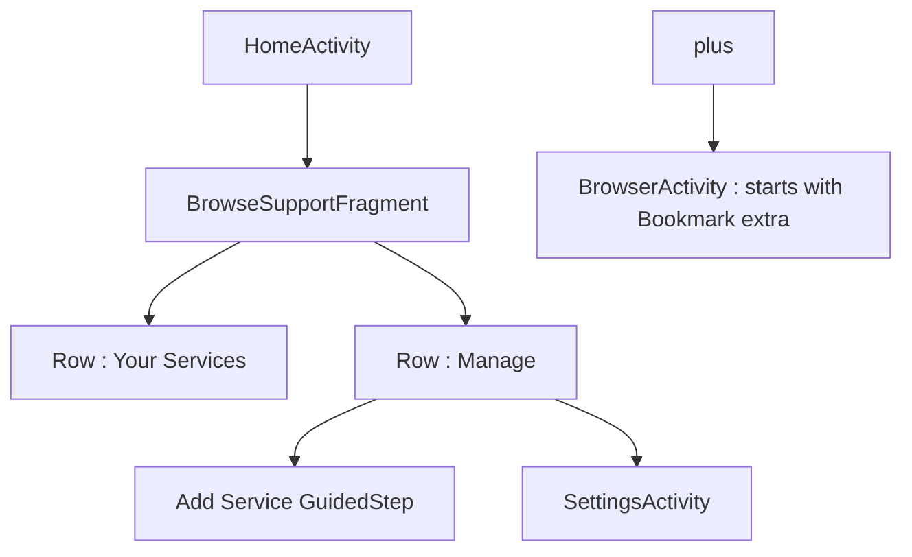
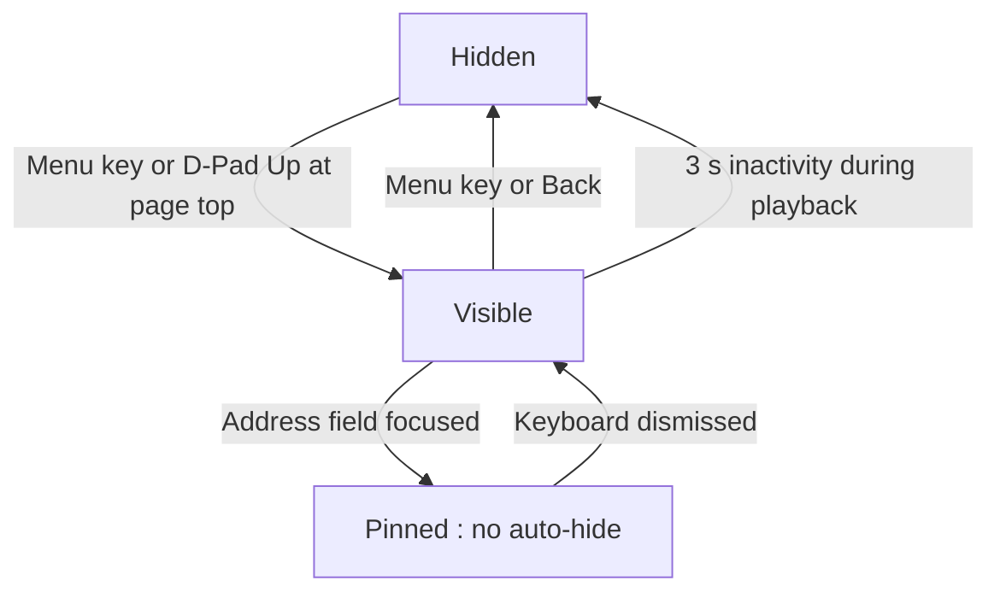

# UI/UX Design — Leanback 10-Foot Interface

## 1. Purpose

Defines the 10-foot user interface: the Leanback home screen, the auto-hiding
browser overlay, TV text input, zoom controls, and the settings surface
(plan §5). Desktop-browser chrome (permanent address bar, tabs) is forbidden.
Consumes input events per [05-input-and-dpad-navigation.md](./05-input-and-dpad-navigation.md)
and persists user choices per
[08-session-and-data-persistence.md](./08-session-and-data-persistence.md).

## 2. Design Principles

| Principle | Rule |
|-----------|------|
| Overscan safety | All interactive elements inside a 5% safe margin (48 dp on 1080p) |
| Legibility | Body text ≥ 20 sp; secondary text ≥ 16 sp; no text below 14 sp anywhere |
| Focus visibility | Every focusable element shows a scale (1.1×) plus accent border; in-page focus uses the injected highlight from [05](./05-input-and-dpad-navigation.md) §5 |
| D-Pad only | No hover states, no long-press-only affordances without an on-screen hint, no touch gestures |
| One-hand rule | Any reachable action is ≤ 3 directional moves from the default focus position |
| No permanent chrome | The address bar exists only inside the overlay; video plays chromeless |

Theme: `Theme.Leanback.Browse` for `HomeActivity`; a dark immersive variant
`Theme.Leanback.Immersive` (black background, no action bar) for
`BrowserActivity`, as declared in
[02-project-setup-and-dependencies.md](./02-project-setup-and-dependencies.md) §4.

## 3. Home Screen

### 3.1 Structure

`HomeActivity` hosts a `BrowseSupportFragment` with two rows:

| Row | Content | Source |
|-----|---------|--------|
| Your Services | User-added and preset service cards, sorted by `sortOrder` | `BookmarkRepository` ([08](./08-session-and-data-persistence.md) §3) |
| Manage | "Add Service" card, "Settings" card | Static |



### 3.2 Service Cards

| Property | Value |
|----------|-------|
| Card size | 300 × 170 dp image zone on `ImageCardView` |
| Image | Service banner/logo; placeholder `R.drawable.ic_service_placeholder` while loading or on fetch failure |
| Title | Service name, single line, 20 sp |
| Default focus | First card in "Your Services" receives focus on fragment creation |

Behavior:

- **Click (D-Pad Center):** launch `BrowserActivity` with the `Bookmark` as a
  Parcelable extra (`EXTRA_BOOKMARK`).
- **Long-press (≥ 600 ms):** context row with Edit, Delete, and
  "Change User Agent" (shortcut to [04](./04-user-agent-strategy.md) §5 flow).
- **Empty state:** if no bookmarks exist, "Your Services" shows a single
  ghost card "Add your first service" that routes to Add Service.

## 4. Browser Overlay

### 4.1 Layout

A top-anchored transport bar, height 96 dp, full width, semi-transparent
scrim (`#CC000000`), containing in left-to-right focus order:

| # | Control | Action |
|---|---------|--------|
| 1 | Back | `webView.goBack()`; disabled state when `!canGoBack()` |
| 2 | Forward | `webView.goForward()`; disabled state when `!canGoForward()` |
| 3 | Refresh | `webView.reload()` |
| 4 | Home | Finish `BrowserActivity`, return to home grid |
| 5 | Address field | Read-only display of current origin + path; click opens text input (§5) |
| 6 | Security indicator | Padlock icon; open padlock with amber tint when page is cleartext HTTP (see [02](./02-project-setup-and-dependencies.md) §5) |
| 7 | Bookmark toggle | Add/remove current page as bookmark; filled star when current origin matches a saved bookmark |
| 8 | Settings | Opens settings panel (§8) as a side sheet |

### 4.2 Show/Hide State Machine



Rules:

1. **Show triggers:** `KEYCODE_MENU`, or D-Pad Up when WebView spatial
   navigation reports focus already at the page top (per
   [05](./05-input-and-dpad-navigation.md) §3).
2. **Auto-hide:** a `Handler` posts a 3 000 ms hide runnable, reset on every
   key event. Auto-hide applies only while a `<video>` is playing or while
   fullscreen is active ([06](./06-video-playback-and-fullscreen.md) §4);
   during ordinary browsing the overlay stays until dismissed, so users are
   not raced by a timer while reading.
3. **Pinned state:** while the address field or any overlay child holds focus
   for text entry, auto-hide is suspended.
4. **Focus contract:** on show, focus moves to the Back button; on hide,
   `webView.requestFocus()` MUST be called (per
   [05](./05-input-and-dpad-navigation.md) §7).
5. The overlay MUST NOT be reachable while the fullscreen custom view is
   attached; Menu is swallowed in that state ([06](./06-video-playback-and-fullscreen.md) §4).

## 5. Text Input

1. A standard `EditText` on the overlay is FORBIDDEN for URL entry.
2. Clicking the address field launches a `GuidedStepSupportFragment` with a
   single editable action, which invokes the native Leanback IME including
   voice input. Alternatively, where a search affordance is added later, use
   `androidx.leanback.widget.SearchBar`.
3. **URL normalization** on commit:

```kotlin
object UrlNormalizer {
    fun normalize(raw: String): String {
        val trimmed = raw.trim()
        require(trimmed.isNotEmpty()) { "empty input rejected at UI layer" }
        val withScheme = if (trimmed.contains("://")) trimmed else "https://$trimmed"
        val uri = Uri.parse(withScheme)
        require(!uri.host.isNullOrBlank()) { "no host" }
        return withScheme
    }
}
```

   - Bare hosts get `https://` prepended; HTTPS is never downgraded to HTTP
     by the normalizer.
   - Invalid input keeps the GuidedStep open with an inline error; it MUST
     NOT navigate to an error page.
4. On commit, the overlay closes and `webView.loadUrl(normalized)` runs on the
   main thread.

## 6. Bookmark Management

Add/Edit uses a two-step `GuidedStepSupportFragment`:

| Step | Fields | Validation |
|------|--------|------------|
| 1. Service | Title (required, ≤ 40 chars), URL (required, §5 normalizer) | URL must normalize; duplicate origin warns but allows |
| 2. Playback | UA mode (DESKTOP default), Text zoom (100/125/150), banner image pick from preset pack | All fields defaulted; step skippable via "Use defaults" |

Saving writes through `BookmarkRepository` on `Dispatchers.IO`
([08](./08-session-and-data-persistence.md) §3) and refreshes the home row on
the next `onResume`.

## 7. Zoom and Text Scaling

| Preset | `textZoom` value | Intended For |
|--------|------------------|--------------|
| Standard | 100 | Well-built responsive sites |
| Large | 125 | Dense desktop layouts (default suggestion for desktop-mode bookmarks) |
| Extra Large | 150 | Sites with small fixed fonts |

Rules:

1. Zoom is **per-bookmark** (`textZoomPercent`, schema in
   [08](./08-session-and-data-persistence.md) §3), not global.
2. Changing zoom in Settings applies via
   `webView.settings.textZoom` and triggers the same confirm-then-reload flow
   as UA switching ([03-webview-configuration.md](./03-webview-configuration.md) §5).
3. Viewport-level scaling (`useWideViewPort`, `loadWithOverviewMode`) is not
   user-adjustable; only `textZoom` is exposed.

## 8. Settings Screen

A `LeanbackPreferenceFragmentCompat` hosted in `SettingsActivity`, sections:

| Setting | Type | Default | Effect / Reference |
|---------|------|---------|--------------------|
| Default User Agent | List: Desktop/Mobile | Desktop | Applies to new bookmarks only; per-bookmark override per [04](./04-user-agent-strategy.md) |
| Text zoom | List: 100/125/150 | 100 | Current bookmark, §7 |
| Pop-up cleanup | Switch | Off | Enables optional content filter, see [10-content-filtering-and-cleanup.md](./10-content-filtering-and-cleanup.md) |
| Clear session data | Action with confirm | — | Clears cookies + DOM storage, see [08](./08-session-and-data-persistence.md) §6 |
| Browser engine | Info row | — | Shows WebView package + version from the provider gate ([02](./02-project-setup-and-dependencies.md) §7) |
| About | Info row | — | App version, spec version |

UA or zoom changes for the **current** bookmark MUST present the confirmation
"Reload page to apply? Playback will stop." before reloading
([04](./04-user-agent-strategy.md) §5).

## 9. Error Handling and Edge Cases

| Failure | Symptom | Handling |
|---------|---------|----------|
| Banner image fetch fails on home grid | Broken image card | Placeholder drawable; never block row rendering on image load |
| Bookmark parcel missing on BrowserActivity start | `NullPointerException` risk | `BrowserActivity` validates `EXTRA_BOOKMARK`; on absence, finish with a toast and log — indicates an external/deep-link entry |
| GuidedStep IME unavailable (no keyboard app) | Voice/keyboard sheet fails to open | Fall back to a D-Pad on-screen key grid (a-z, 0-9, ".", "/") — REQUIRED fallback, since some boxes ship without Gboard |
| Overlay show/hide animation during key burst | Focus lands on hidden button | Hide is immediate (no exit animation) when triggered by auto-hide; focus is force-returned to WebView first |
| Auto-hide runnable leaks after activity destroy | `IllegalStateException` on post | Controller removes callbacks in `onDestroy`; all posts use the activity's main `Handler` |
| Long-press on home card also triggers click | Service launches while context row opens | Consume the long-press in `onItemLongClicked` returning `true`; click is only fired on key-up without long-press |
| Settings changed while playback active | Reload would kill video | Confirmation dialog (§8); if fullscreen active, settings sheet is unreachable ([06](./06-video-playback-and-fullscreen.md) §4) |
| Voice input returns empty string | Normalizer throws | Caught at UI layer; GuidedStep shows "Say or type an address" hint again |

## 10. Cross-References

- Input/focus plumbing: [05-input-and-dpad-navigation.md](./05-input-and-dpad-navigation.md)
- Fullscreen interactions: [06-video-playback-and-fullscreen.md](./06-video-playback-and-fullscreen.md)
- Bookmark persistence: [08-session-and-data-persistence.md](./08-session-and-data-persistence.md)
- Error cards layered over these surfaces: [09-error-handling-and-recovery.md](./09-error-handling-and-recovery.md) §4
