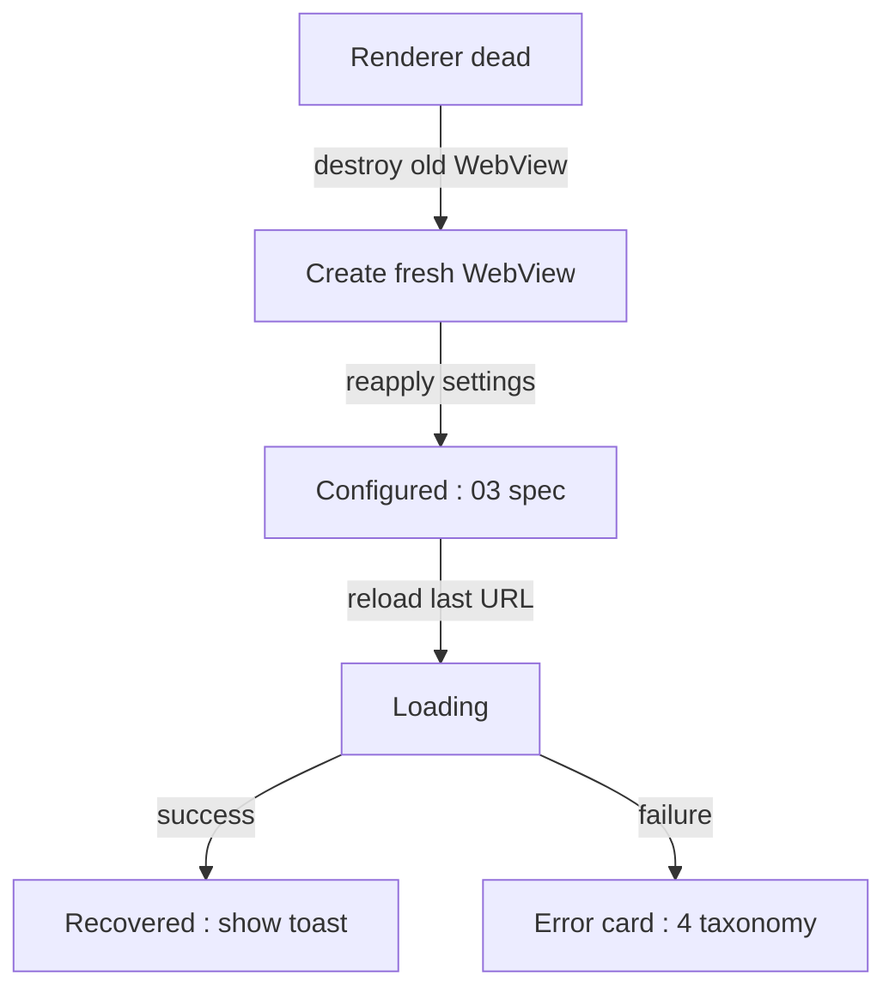

# Error Handling and Recovery

## 1. Purpose

Converts WebView failure callbacks into TV-friendly, actionable error surfaces
instead of blank pages (plan §6), and defines recovery from renderer process
death. Sits on the WebView from
[03-webview-configuration.md](./03-webview-configuration.md) and renders cards
in the style of [07-ui-ux-leanback-design.md](./07-ui-ux-leanback-design.md).

## 2. Detection Surfaces

| Callback | Fires For | Card? |
|----------|-----------|-------|
| `WebViewClient.onReceivedError` (main frame) | Network-level failures: DNS, timeout, refused | Yes |
| `WebViewClient.onReceivedError` (subresource) | Asset failures | No — log only |
| `WebViewClient.onReceivedHttpError` | HTTP ≥ 400 on any request | Only for main frame |
| `WebViewClient.onReceivedSslError` | Certificate failures | Yes (§6.1, strict) |
| `WebViewClient.onRenderProcessGone` (API 26+) | Renderer crash/OOM | Recovery flow §5 |
| `WebViewClient.onSafeBrowsingHit` | Safe Browsing interstitial | Delegate to WebView interstitial, then §6.2 |
| Injected EME hook | DRM license failures | Yes — DRM card ([06](./06-video-playback-and-fullscreen.md) §5) |
| `ConnectivityManager` callback | Offline/online transitions | Banner, §6.3 |

## 3. Error Taxonomy

| Category | Trigger Codes | User Copy Key | Auto-Retry |
|----------|---------------|---------------|------------|
| Network unreachable | `ERROR_HOST_LOOKUP`, `ERROR_CONNECT`, `ERROR_TIMEOUT`, `ERROR_IO` | `network` | Yes, §4.3 |
| HTTP client error | `onReceivedHttpError` 400–499 main frame | `http_client` | No |
| HTTP server error | 500–599 main frame | `http_server` | Yes, §4.3 |
| TLS failure | `onReceivedSslError` | `ssl` | No — never auto-retried |
| Service blocking | 403 main frame, or login redirect loop (≥ 3 redirects to same login URL) | `blocked` | No |
| DRM unsupported | EME `NotSupportedError` from injected hook | `drm` | No |
| Renderer death | `onRenderProcessGone` | `renderer` | Recovery, §5 |
| Safe Browsing | `onSafeBrowsingHit` | `safebrowsing` | No |

## 4. TV-Friendly Error Cards

### 4.1 Layout

Full-screen card replacing WebView content (WebView set to `INVISIBLE`, not
`GONE`, to keep its state): centered icon (96 × 96 dp), title 28 sp, body
20 sp, and up to three buttons in fixed focus order: **Retry**, **Switch User
Agent**, **Home**. Default focus is Retry. Back dismisses the card and returns
focus to the WebView per [05-input-and-dpad-navigation.md](./05-input-and-dpad-navigation.md) §3.

### 4.2 Copy Table (normative strings)

| Key | Title | Body |
|-----|-------|------|
| `network` | Can't reach this service | Check your internet connection, then try again. |
| `http_client` | Page not available | The service returned an error (HTTP {code}). Try again later. |
| `http_server` | Service is having trouble | The service returned an error (HTTP {code}). This is usually temporary. |
| `ssl` | Secure connection failed | This service's security certificate could not be verified. The page was not loaded. |
| `blocked` | Video unavailable | This service may block TV browsers. Try switching User Agent in Settings. |
| `drm` | Protected video not supported | This service requires a level of copy protection that TV web browsers don't support. Playback may fail or be limited to low quality. |
| `renderer` | The page crashed | The browser engine restarted. Your login is kept; the page will reload. |
| `safebrowsing` | Deceptive site warning | This site may try to steal your information. Going back is recommended. |

### 4.3 Retry Policy

1. Automatic retry applies only to `network` and `http_server` categories.
2. Backoff: 2 s, 5 s, 15 s; maximum 3 automatic attempts, then the card waits
   for a manual Retry. Manual Retry resets the counter.
3. Automatic retries are cancelled on: any key event, connectivity change,
   activity pause, or a new `loadUrl`.
4. A retry MUST NOT replay a POST (streaming sites rarely POST for the main
   frame, but guard anyway): if the failing request method was not GET/HEAD,
   show the card without auto-retry.

## 5. Renderer Death Recovery

```kotlin
override fun onRenderProcessGone(view: WebView, detail: RenderProcessGoneDetail): Boolean {
    chromeClient.exitFullscreen()            // detach custom view first (06 §6)
    (view.parent as? ViewGroup)?.removeView(view)
    view.destroy()                           // mandatory: the WebView is unusable
    stateMachine.onRendererDead(detail.didCrash())
    return true                              // we handled it; do not crash the app
}
```

Recovery state machine:



Rules:

1. Returning `true` from `onRenderProcessGone` without destroying the WebView
   is FORBIDDEN — subsequent calls on it throw.
2. The fresh WebView is configured through the same `WebViewConfigurator`
   ([03](./03-webview-configuration.md) §3) with the same bookmark, so UA,
   zoom, and cookies are preserved; sessions survive because cookies live in
   the shared profile ([08](./08-session-and-data-persistence.md) §4).
3. If renderer death recurs ≥ 3 times within 60 s, stop auto-recovery and show
   the `renderer` card with Home as default focus — indicates a site or
   device-level incompatibility, logged for
   [12-testing-and-validation-matrix.md](./12-testing-and-validation-matrix.md).

## 6. Edge Cases and Special Flows

### 6.1 SSL Errors — Strict Policy

`handler.proceed()` is FORBIDDEN in all builds. Always `handler.cancel()` and
show the `ssl` card. There is no "advanced → proceed anyway" affordance; a TV
browser for streaming logins must not train users to bypass certificate
warnings (see [11-security-privacy-and-drm.md](./11-security-privacy-and-drm.md) §3).

### 6.2 Safe Browsing

Let WebView render its own interstitial (`onSafeBrowsingHit` →
`callback?.proceed(false)`-equivalent default handling: report and show). The
app adds no "proceed" shortcut beyond the platform interstitial's own.

### 6.3 Offline Banner

On `ConnectivityManager` loss: a thin top banner "No connection" appears
without disturbing the page; on regain, banner hides and, if an error card of
category `network` is showing, an automatic retry fires immediately.

### 6.4 Login Redirect Loop Detection

`TvWebViewClient` keeps a ring buffer of the last 8 main-frame URLs. If the
same login URL appears ≥ 3 times within 10 s, classify as `blocked` (cookie or
UA problem) and show the `blocked` card instead of looping forever. This is
the detection mechanism referenced by
[03-webview-configuration.md](./03-webview-configuration.md) §8.

### 6.5 Subresource Failures

Never surface cards for subresource errors (a failed avatar or ad beacon must
not interrupt playback). They are logged with URL and code, sampled, and feed
the per-service notes in
[12-testing-and-validation-matrix.md](./12-testing-and-validation-matrix.md).

## 7. Error Handling Self-Tests

```kotlin
class ErrorTaxonomyTest {

    private val classifier = ErrorClassifier()

    @Test fun dnsFailureIsNetworkCategory() {
        assertEquals(Category.NETWORK,
            classifier.fromErrorCode(WebViewClient.ERROR_HOST_LOOKUP))
    }

    @Test fun http403IsBlockedCategory() {
        assertEquals(Category.BLOCKED, classifier.fromHttpCode(403))
    }

    @Test fun http500IsServerCategoryWithRetry() {
        val c = classifier.fromHttpCode(503)
        assertEquals(Category.HTTP_SERVER, c)
        assertTrue(classifier.isAutoRetryable(c))
    }

    @Test fun sslIsNeverRetryable() {
        assertFalse(classifier.isAutoRetryable(Category.SSL))
    }

    @Test fun loginLoopDetectedAfterThreeHits() {
        val d = RedirectLoopDetector(windowMs = 10_000, threshold = 3)
        repeat(3) { d.onUrl("https://svc.example/login") }
        assertTrue(d.isLooping())
    }
}
```

## 8. Cross-References

- Fullscreen teardown before recovery: [06-video-playback-and-fullscreen.md](./06-video-playback-and-fullscreen.md) §6
- Session survival across recovery: [08-session-and-data-persistence.md](./08-session-and-data-persistence.md) §4
- Security rationale for strict SSL: [11-security-privacy-and-drm.md](./11-security-privacy-and-drm.md) §3
- Card visual language: [07-ui-ux-leanback-design.md](./07-ui-ux-leanback-design.md) §2
