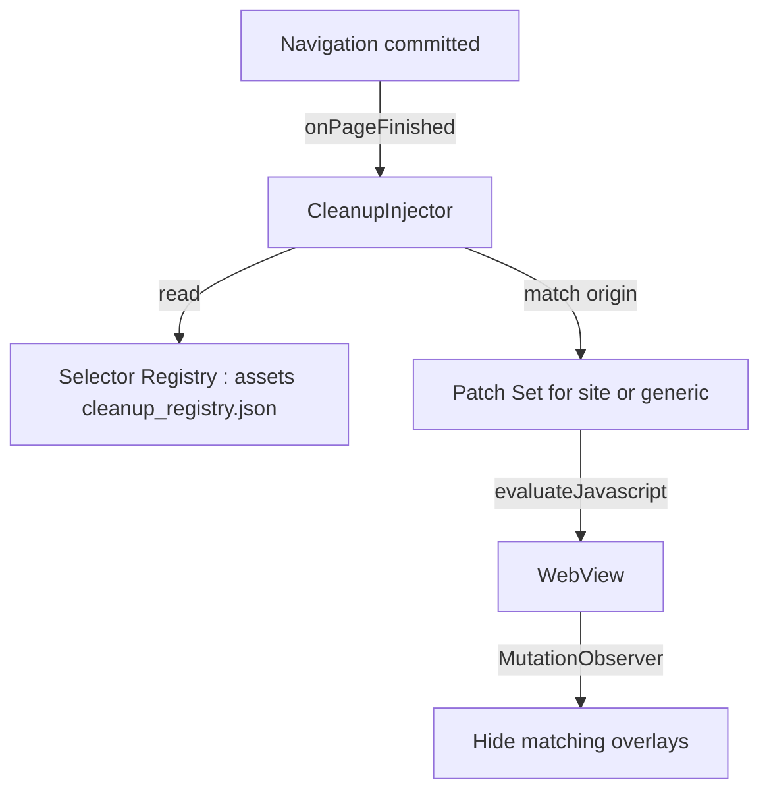

# Content Filtering and Page Cleanup

## 1. Purpose

Specifies the optional, lightweight cleanup layer that hides overlay pop-ups
which are impossible to close with a remote (plan §6), plus the registry for
site-specific JS patches referenced by
[05-input-and-dpad-navigation.md](./05-input-and-dpad-navigation.md) §6, §8 and
[06-video-playback-and-fullscreen.md](./06-video-playback-and-fullscreen.md) §6.
Runs on the injection pipeline of
[03-webview-configuration.md](./03-webview-configuration.md).

## 2. Principles (Normative)

1. **Opt-in only.** Disabled by default; enabled via the "Pop-up cleanup"
   switch ([07-ui-ux-leanback-design.md](./07-ui-ux-leanback-design.md) §8),
   persisted as `content_filter_enabled`
   ([08-session-and-data-persistence.md](./08-session-and-data-persistence.md) §5).
2. **Transparent.** The settings row states exactly what it does: "Hides
   newsletter sign-up and cookie pop-ups that can't be closed with the remote.
   Does not block ads in videos."
3. **Not an ad blocker.** No network-level filtering, no filter-list
   subscriptions, no video-ad interference. Cosmetic hiding of modal overlays
   only. This boundary is legal/ethical, not technical (see
   [11-security-privacy-and-drm.md](./11-security-privacy-and-drm.md) §5).
4. **Reversible.** Disabling the switch removes all effects on next page load;
   no residue.

## 3. Architecture



Injection timing follows the same rules as focus CSS
([05](./05-input-and-dpad-navigation.md) §5): `onPageFinished` plus
`doUpdateVisitedHistory` for SPA navigations, idempotent via a guard element.

## 4. Selector Registry

`app/src/main/assets/cleanup_registry.json` — versioned, reviewed per release:

```json
{
  "version": 3,
  "generic": {
    "hideSelectors": [
      "[class*='newsletter-modal']",
      "[class*='signup-overlay']",
      "[id*='cookie-consent']:not([id*='player'])",
      "[class*='modal-backdrop']"
    ],
    "closeButtonSelectors": [
      "[class*='modal'] [aria-label='Close']",
      "[class*='overlay'] [class*='close']"
    ]
  },
  "sites": [
    {
      "origin": "https://example-regional-tv.example",
      "hideSelectors": ["#age-gate-overlay"],
      "notes": "Age gate has no focusable close; hidden after 2s delay"
    }
  ]
}
```

Rules:

1. `generic` selectors apply to every site when the feature is on.
2. `sites` entries apply only when the current origin matches exactly
   (scheme + host, per the `origin` field in
   [08](./08-session-and-data-persistence.md) §3).
3. Selectors MUST prefer hiding over removing (`display: none`), because
   removing nodes breaks SPAs that later query them.
4. Every registry change bumps `version` and is recorded in the release notes;
   this is the "centralized and versioned selectors" mitigation from
   [01-architecture-overview.md](./01-architecture-overview.md) §11.

## 5. Injection Implementation

```kotlin
class CleanupInjector(
    private val registry: CleanupRegistry,
    private val isEnabled: () -> Boolean
) {
    fun inject(webView: WebView, origin: String) {
        if (!isEnabled()) return
        val selectors = registry.selectorsFor(origin) ?: return
        val jsArray = selectors.joinSelection() { "\"$it\"" }
        webView.evaluateJavascript(
            """(function(){
                 if (window.__tvCleanup) return;
                 window.__tvCleanup = true;
                 var sel = [$jsArray];
                 function hide(){
                   sel.forEach(function(s){
                     document.querySelectorAll(s).forEach(function(el){
                       el.style.setProperty('display','none','important');
                     });
                   });
                 }
                 hide();
                 new MutationObserver(hide).observe(
                   document.documentElement,
                   {childList:true, subtree:true}
                 );
               })();""", null
        )
    }
}
```

Also hosted here (same pipeline, separate functions):

| Patch | Referenced From | Behavior |
|-------|-----------------|----------|
| Largest-video selector | [05](./05-input-and-dpad-navigation.md) §6 | Upgrades `MediaKeyInjector` to pick the visible `<video>` with the largest `clientWidth × clientHeight` when multiple exist |
| Keydown pass-through | [05](./05-input-and-dpad-navigation.md) §8 | Site-specific removal of `preventDefault` handlers that swallow D-Pad keys; NEVER applied globally |
| Wrapper-fullscreen logger | [06](./06-video-playback-and-fullscreen.md) §6 | Detects fullscreen-on-div pattern and logs domain for registry follow-up |

## 6. Error Handling and Edge Cases

| Failure | Symptom | Handling |
|---------|---------|----------|
| Site markup drift invalidates a selector | Pop-up returns | Registry version bump; generic selectors are broad enough to catch most cases in the interim |
| Selector over-matches and hides the player | Black screen | Registry rule: any selector containing `player`, `video`, `player-container` is rejected at build time by a lint test (§7); field reports trigger immediate registry rollback |
| MutationObserver loop on heavy SPA | CPU spike | Observer callback is throttled to one pass per 500 ms via `setTimeout` guard |
| CSP blocks inline script | Cleanup silently absent | Acceptable degradation, same policy as focus CSS ([05](./05-input-and-dpad-navigation.md) §5 rule 3) |
| Registry JSON corrupt in APK | Parse exception at first injection | Ship a compile-time validated copy; runtime parse failure disables the feature and logs — never crashes navigation |
| User enables filter mid-session | No effect until reload | Documented in settings summary: "Applies to newly loaded pages" |

## 7. Build-Time Guard Test

```kotlin
class CleanupRegistryTest {

    private val registry = CleanupRegistry.loadFromAssets("cleanup_registry.json")

    @Test fun noSelectorTargetsPlayerElements() {
        val banned = listOf("player", "video", "player-container")
        registry.allSelectors().forEach { sel ->
            banned.forEach { token ->
                assertFalse("selector '$sel' targets '$token'",
                    sel.contains(token, ignoreCase = true))
            }
        }
    }

    @Test fun registryHasVersionAndValidOrigins() {
        assertTrue(registry.version >= 1)
        registry.sites().forEach {
            assertTrue(it.origin.startsWith("https://"))
        }
    }
}
```

## 8. Cross-References

- Toggle UI and persistence: [07-ui-ux-leanback-design.md](./07-ui-ux-leanback-design.md) §8,
  [08-session-and-data-persistence.md](./08-session-and-data-persistence.md) §5
- Injection pipeline and timing: [05-input-and-dpad-navigation.md](./05-input-and-dpad-navigation.md) §5
- Legal boundary: [11-security-privacy-and-drm.md](./11-security-privacy-and-drm.md) §5
